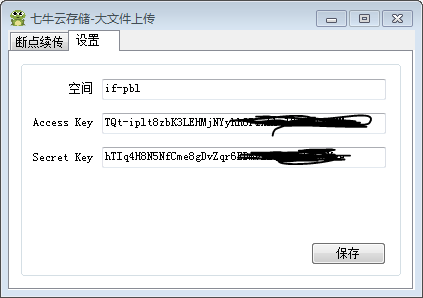
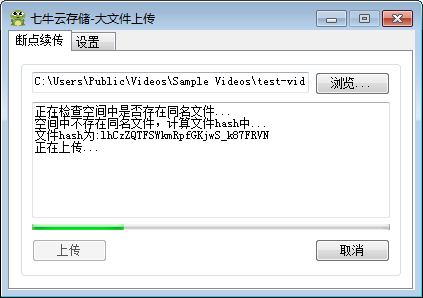

# QFrog

#简介
一个一次只能上传一个文件到七牛空间的工具。支持断点续传。
原来是用来测试 [Qiniu C# SDK](https://github.com/jemygraw/qiniu-csharp-sdk)

#下载
[QFrog v1.4](http://qdisk.qiniudn.com/QFrog_v1.4.zip)

大概就是这样：

设置AK & SK

上传文件

如果你有大量文件需要上传，另外也想用一个图形化工具，请使用[QSunSync](https://github.com/qiniu-lab/qsunsync) 。